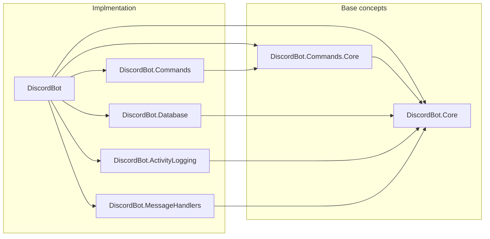

# Project's structure

```mermaid
flowchart LR

A[DiscordBot.Core] 
B[DiscordBot.Commands.Core]
C[DiscordBot.Commands]
D[DiscordBot.Database]
E[DiscordBot.ActivityLogging]
F[DiscordBot.MessageHandlers]
G[DiscordBot]

subgraph Implmentation
G --> C
G --> D
G --> E
G --> F
end

subgraph Base concepts
G ---> A
G ---> B
C --> B
B --> A
D --> A
E --> A
F --> A
end
```